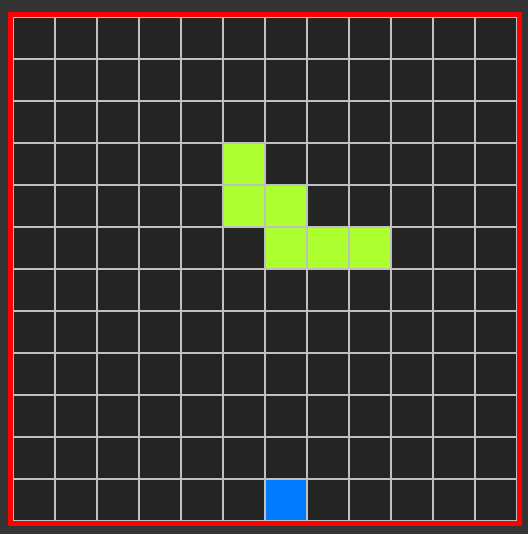
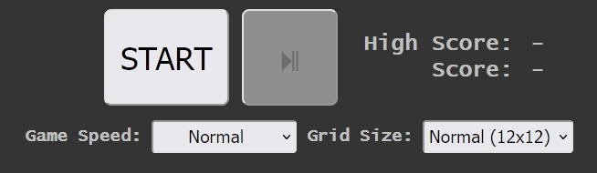
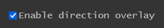

# basic-snek-js

**Snake** in your browser!

## How to play
- Go [here](https://www.havila.dev/basic-snek-js/)
- Press `Start`
- Control *Snek* with WASD or your arrow keys (or just swipe in mobile)
- Pause with your spacebar or by clicking the ⏯ button

## Game options

You can configure your settings before each game, these include:

- Game speed: How fast *Snek* will move within the grid
- Grid size: How big the game area will be
- Enable direction overlay: Toggle an overlay showing the latest input (recommended for mobile)

You can also learn more by pressing the `?` button at the top-right corner of the screen.
